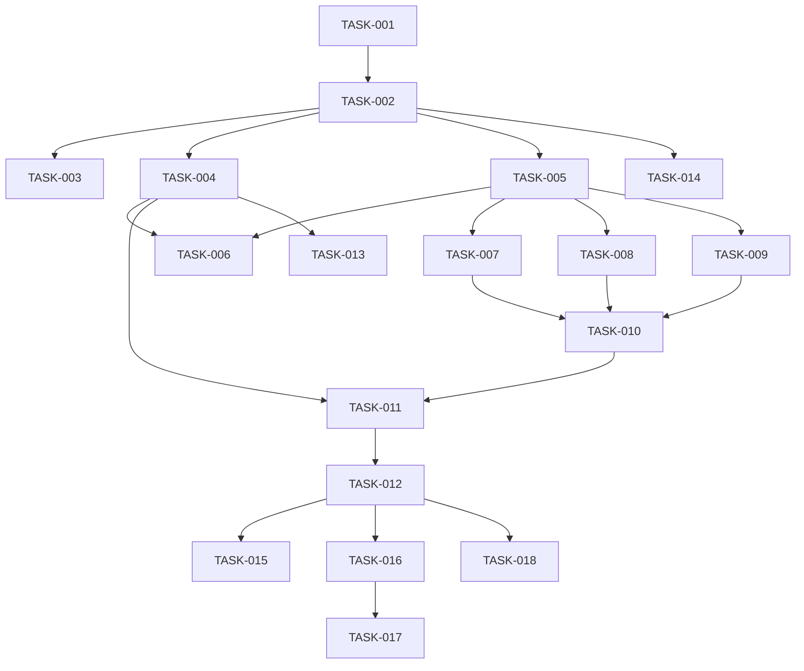

# 股票历史数据接口实现任务列表

## 任务分解

### 1. 数据库模块

#### 1.1 创建数据库目录结构和初始化模块
- **任务ID**: TASK-001
- **优先级**: P0
- **依赖项**: None
- **描述**:
  - 创建数据库相关目录结构
  - 实现数据库初始化函数
  - 实现数据库路径配置
- **验收标准**:
  - 数据库目录结构完整
  - 数据库初始化函数正常工作
  - 数据库路径配置正确

#### 1.2 实现数据库表结构和索引
- **任务ID**: TASK-002
- **优先级**: P0
- **依赖项**: TASK-001
- **描述**:
  - 创建 equity_price_history 表
  - 创建 equity_metadata 表
  - 创建必要的索引
- **验收标准**:
  - 表结构创建成功
  - 索引创建成功
  - 表结构验证正确

#### 1.3 实现数据库优化配置
- **任务ID**: TASK-003
- **优先级**: P1
- **依赖项**: TASK-002
- **描述**:
  - 启用 WAL 模式
  - 设置同步模式为 NORMAL
  - 启用外键约束
  - 设置缓存大小和内存映射
- **验收标准**:
  - 优化配置应用成功
  - 数据库性能提升

### 2. 数据访问层

#### 2.1 实现数据查询功能
- **任务ID**: TASK-004
- **优先级**: P0
- **依赖项**: TASK-002
- **描述**:
  - 实现按股票代码查询历史数据
  - 实现按日期范围查询
  - 实现获取最新数据日期
- **验收标准**:
  - 查询功能正常工作
  - 查询性能达标
  - 数据返回正确

#### 2.2 实现数据写入和增量更新
- **任务ID**: TASK-005
- **优先级**: P0
- **依赖项**: TASK-002
- **描述**:
  - 实现批量写入功能
  - 实现增量更新逻辑 (Upsert)
  - 实现数据格式转换
- **验收标准**:
  - 数据写入成功
  - 增量更新逻辑正确
  - 写入性能达标

#### 2.3 实现错误处理和重试机制
- **任务ID**: TASK-006
- **优先级**: P1
- **依赖项**: TASK-004, TASK-005
- **描述**:
  - 实现数据库锁定重试机制
  - 实现数据校验逻辑
  - 实现事务管理
  - 实现日志记录
- **验收标准**:
  - 错误处理机制有效
  - 重试机制正常工作
  - 数据一致性保证

### 3. 数据源适配器

#### 3.1 实现 akshare 数据源适配器
- **任务ID**: TASK-007
- **优先级**: P1
- **依赖项**: TASK-005
- **描述**:
  - 实现 akshare 数据获取
  - 实现数据格式转换
  - 实现错误处理
- **验收标准**:
  - akshare 数据获取正常
  - 数据格式转换正确
  - 错误处理有效

#### 3.2 实现 yfinance 数据源适配器
- **任务ID**: TASK-008
- **优先级**: P1
- **依赖项**: TASK-005
- **描述**:
  - 实现 yfinance 数据获取
  - 实现数据格式转换
  - 实现错误处理
- **验收标准**:
  - yfinance 数据获取正常
  - 数据格式转换正确
  - 错误处理有效

#### 3.3 实现 tushare 数据源适配器
- **任务ID**: TASK-009
- **优先级**: P2
- **依赖项**: TASK-005
- **描述**:
  - 实现 tushare 数据获取
  - 实现数据格式转换
  - 实现错误处理
- **验收标准**:
  - tushare 数据获取正常
  - 数据格式转换正确
  - 错误处理有效

#### 3.4 实现数据源优先级管理
- **任务ID**: TASK-010
- **优先级**: P1
- **依赖项**: TASK-007, TASK-008, TASK-009
- **描述**:
  - 实现数据源优先级逻辑
  - 实现数据源故障切换
  - 实现数据源选择策略
- **验收标准**:
  - 数据源优先级逻辑正确
  - 数据源故障切换正常
  - 数据源选择策略有效

### 4. API 路由

#### 4.1 实现 API 端点
- **任务ID**: TASK-011
- **优先级**: P0
- **依赖项**: TASK-004, TASK-010
- **描述**:
  - 实现 `GET /api/v1/cn/equity/price/historical` 接口
  - 实现请求参数验证
  - 实现响应格式标准化
- **验收标准**:
  - API 接口正常响应
  - 参数验证逻辑正确
  - 响应格式符合规范

#### 4.2 实现业务逻辑
- **任务ID**: TASK-012
- **优先级**: P0
- **依赖项**: TASK-011
- **描述**:
  - 实现缓存查询逻辑
  - 实现数据获取流程
  - 实现错误处理
  - 实现响应数据格式化
- **验收标准**:
  - 缓存机制有效
  - 数据获取流程正确
  - 错误处理机制有效
  - 响应数据格式正确

### 5. 性能优化和监控

#### 5.1 实现查询性能优化
- **任务ID**: TASK-013
- **优先级**: P2
- **依赖项**: TASK-004
- **描述**:
  - 优化查询语句
  - 验证索引效果
  - 测试查询性能
- **验收标准**:
  - 查询性能达标
  - 索引效果明显
  - 查询响应时间 < 50ms

#### 5.2 实现数据库维护功能
- **任务ID**: TASK-014
- **优先级**: P2
- **依赖项**: TASK-002
- **描述**:
  - 实现定期维护功能
  - 实现数据库备份
  - 实现数据清理
- **验收标准**:
  - 维护功能正常工作
  - 数据库性能稳定
  - 数据备份成功

#### 5.3 实现监控和日志记录
- **任务ID**: TASK-015
- **优先级**: P2
- **依赖项**: TASK-012
- **描述**:
  - 配置日志记录
  - 设置监控指标
  - 实现错误监控
- **验收标准**:
  - 日志记录完整
  - 监控指标有效
  - 错误监控正常

### 6. 测试与文档

#### 6.1 编写单元测试
- **任务ID**: TASK-016
- **优先级**: P2
- **依赖项**: 所有功能模块
- **描述**:
  - 编写数据库模块测试
  - 编写数据访问层测试
  - 编写数据源适配器测试
  - 编写 API 路由测试
- **验收标准**:
  - 单元测试覆盖率 > 80%
  - 所有单元测试通过
  - 测试用例完整

#### 6.2 编写集成测试
- **任务ID**: TASK-017
- **优先级**: P2
- **依赖项**: TASK-016
- **描述**:
  - 测试模块间协作
  - 测试完整数据流程
  - 测试数据源故障切换
- **验收标准**:
  - 集成测试通过
  - 模块协作正常
  - 数据流程完整

#### 6.3 更新文档
- **任务ID**: TASK-018
- **优先级**: P2
- **依赖项**: 所有功能模块
- **描述**:
  - 更新 API 文档
  - 更新数据库文档
  - 更新测试文档
- **验收标准**:
  - 文档完整准确
  - 文档与实现一致
  - 文档格式规范

## 任务优先级

| 优先级 | 说明 |
|--------|------|
| P0 | 核心功能，必须优先实现 |
| P1 | 重要功能，次优先实现 |
| P2 | 辅助功能，最后实现 |

## 任务依赖关系

## 实施计划

### 阶段 1: 数据库模块 (2 天)
- TASK-001: 创建数据库目录结构和初始化模块
- TASK-002: 实现数据库表结构和索引
- TASK-003: 实现数据库优化配置

### 阶段 2: 数据访问层 (2 天)
- TASK-004: 实现数据查询功能
- TASK-005: 实现数据写入和增量更新
- TASK-006: 实现错误处理和重试机制

### 阶段 3: 数据源适配器 (2 天)
- TASK-007: 实现 akshare 数据源适配器
- TASK-008: 实现 yfinance 数据源适配器
- TASK-009: 实现 tushare 数据源适配器
- TASK-010: 实现数据源优先级管理

### 阶段 4: API 路由 (1 天)
- TASK-011: 实现 API 端点
- TASK-012: 实现业务逻辑

### 阶段 5: 性能优化和监控 (1 天)
- TASK-013: 实现查询性能优化
- TASK-014: 实现数据库维护功能
- TASK-015: 实现监控和日志记录

### 阶段 6: 测试与文档 (1 天)
- TASK-016: 编写单元测试
- TASK-017: 编写集成测试
- TASK-018: 更新文档

## 总计: 9 天